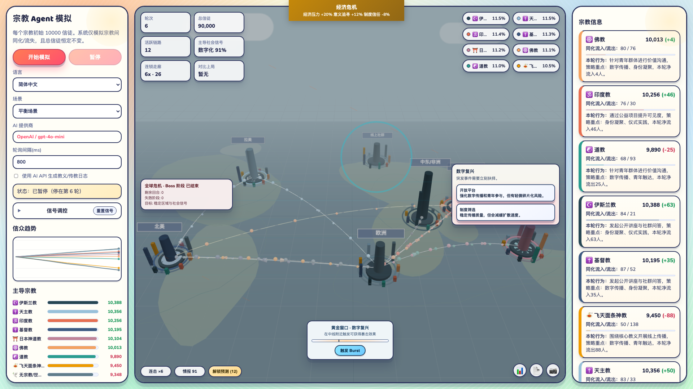

<div align="center">

# Religion Agent Simulation

An interactive multi-agent simulation game exploring how religions compete, coexist, and evolve under social pressures.

[](https://nodejs.org/)
[](https://threejs.org/)
[](https://platform.openai.com/docs/api-reference)
[](./LICENSE)
[](https://github.com/crazywoola/religion-agent-simulation/stargazers)
[](https://github.com/crazywoola/religion-agent-simulation/network/members)
[](https://github.com/crazywoola/religion-agent-simulation/issues)
[](https://github.com/crazywoola/religion-agent-simulation/commits/main)

English | [简体中文](./README.zh-CN.md) | [日本語](./README.ja.md)

</div>

## What is this?

This is a browser-based strategy simulation where 9 religions (including a secular movement) compete for followers across 7 world regions. Each religion has unique traits, governance rules, and a passive ability that subtly shapes the social landscape. You don't control any single religion — instead, you influence the world through event decisions, strategy cards, signal tuning, and risk bets while the simulation runs.



## How AI is Used

The simulation works in two modes:

- **Rule-only mode** (no API key needed): All follower transfers are computed by a mathematical model based on religion traits, governance parameters, social signals, and regional factors. Action logs are generated from localized templates. This mode is fully functional on its own.

- **AI-enhanced mode** (requires an API key): A large language model generates richer, context-aware action narratives for each religion per round, proposes transfer corridors based on the current state, and can produce academic-style PDF analysis reports. The AI acts as a creative layer on top of the rule engine — it enriches the experience but never overrides the simulation math.

Any **OpenAI-compatible** API provider works: OpenAI, Moonshot/Kimi, Ollama, LM Studio, or any service that exposes a `/v1/chat/completions` endpoint.

## Key Features

- **9 Religions** — Buddhism, Hinduism, Taoism, Islam, Protestant, Pastafarianism, Catholicism, Shinto, and Secular — each with distinct metrics, traits, governance, doctrine, and a unique passive ability
- **7 World Regions** — North America, Latin America, Europe, Middle East/Africa, South Asia, East Asia, and Online Communities — each with unique social factor profiles
- **14 Random Events** — From religious scandals to AI doctrine leaks, each with narrative chain follow-ups and player decision options that shift social signals
- **Strategy Deck** — 15 cards across 3 types: immediate effect, conditional (doubles when a threshold is met), and sustained (applies over 2-3 rounds)
- **Religious Judgment System** — Religions with high orthodoxy can block incoming conversions through tribunal proceedings, with reason-specific log descriptions
- **Boss Crisis** — Multi-phase raids with real-time pass/fail threshold displays; failing phases applies lasting penalties
- **Territory Control** — Region ownership, streaks, and territory bonuses that affect retention and outreach
- **Risk Bets & Combos** — 5 bet types, corridor combo chains, and a ghost comparison system
- **3D Visualization** — Interactive Three.js map with animated ant-line transfer corridors, region nodes, and event overlays
- **Rich Log System** — Mission, Judgment, Event, Passive, and Territory logs with context-specific text and filter options
- **Localization** — Full runtime switching between English, Simplified Chinese, and Japanese

## Quick Start

Requires **Node.js 24+**.

```bash
npm install
cp .env.example .env
# Optionally fill in AI_API_KEY for AI-enhanced mode
npm run dev
```

Open `http://localhost:3000` in your browser.

## Configuration

| Variable | Purpose | Default |
| --- | --- | --- |
| `AI_PROVIDER` | AI provider (`openai` or `moonshot`) | `openai` |
| `AI_API_KEY` | API key (leave empty for rule-only mode) | — |
| `AI_MODEL` | Model name override | provider default |
| `PORT` | Server port | `3000` |

See [`.env.example`](.env.example) for all available options including timeout, retry, proxy, and logging settings.

## Disclaimer

This project is a technical simulation and visualization demo. It does not represent real-world religious statistics, truth claims, or value judgments.
